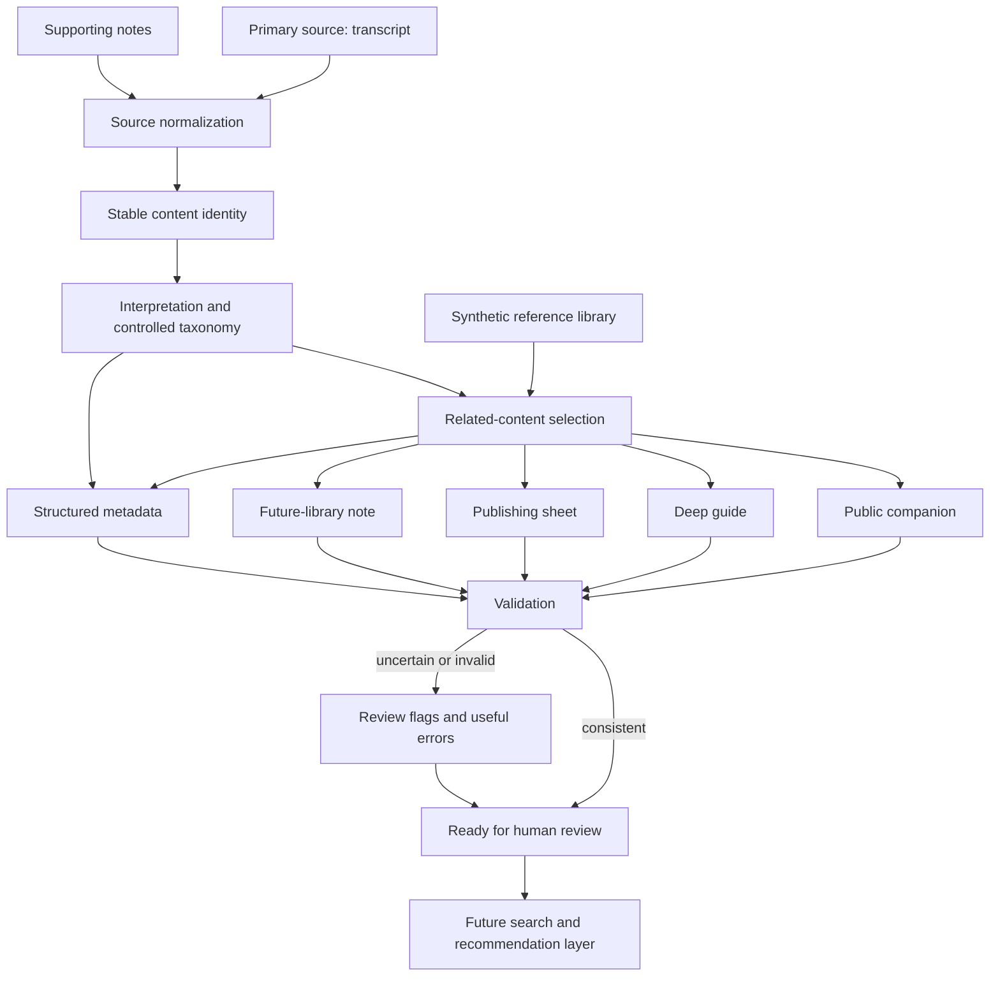

# AI Content Operations Pipeline

This clean-room prototype turns one long-form content source into coordinated audience resources, publishing support, and structured library metadata. It demonstrates content operations and knowledge architecture: the workflow tracks where information came from, gives each output a clear purpose, keeps content identity stable, and surfaces uncertainty for a person to resolve.

The workflow began as a natural-language operating procedure. This prototype translates its operating ideas into explicit code and testable output contracts. It was derived from a real content-production operating system used to turn long-form source material into audience resources, publishing assets, and structured library metadata. The public edition uses synthetic content and a clean-room implementation.

## The operational problem

A single source item often needs several different outputs. Treating that work as “ask a model to write five things” can blur the difference between source facts, editorial interpretation, publishing tasks, and data needed by a future content library. This pipeline models those jobs separately while keeping them connected through a stable `content_id`.

## How the workflow works

1. Read a primary source and supporting notes.
2. Normalize identity, source type, dates, and known URLs.
3. Apply deterministic taxonomy rules and propose related items from a synthetic reference library.
4. Generate a short public companion, a deeper educational guide, a publishing sheet, and a future-library note.
5. Produce one JSON metadata record and validate its schema, controlled vocabulary, identifiers, dates, relationships, and uncertainty flags.
6. Leave unresolved decisions visible for human review.



See [the architecture notes](docs/architecture.md) for the boundaries between pipeline stages.

## System design

### Source hierarchy

The primary transcript or source content controls factual details such as what practice was actually described. Supporting notes can fill gaps but do not override conflicting primary-source facts. Templates define output shape; metadata rules define structure; the reference library suggests links and avoids unnecessary duplication. Missing information stays missing.

### Purpose-specific output contracts

- **Public companion:** a brief reflection or practical interaction with the source, not a summary.
- **Deep guide:** orientation, reflection, teaching, pattern mapping, practice, and integration. It is educational and non-clinical.
- **Publishing sheet:** copy-ready material, title and SEO suggestions, a suggested slug, and clear placeholders for unconfirmed links.
- **Future-library note:** concise topic, fit, tags, relationships, and a possible future search or recommendation use.

### Stable identity and metadata

The `content_id` is lowercase, underscore-separated, and independent from the public title or URL. A draft ID is visibly temporary. A finalized ID cannot be silently changed. All generated layers use the same identity.

Controlled fields such as pathway, modality, depth, and practice type use small vocabularies so software can filter them consistently. Dynamic tags preserve nuanced listener language such as “peace feels unfamiliar.” These layers are separate by design.

Related-content links store stable IDs, never display titles. The synthetic library is used to suggest relevant items and provide examples for cross-linking; a human still decides whether a suggestion belongs.

### Uncertainty and review

The example notes suggest a body scan, but the synthetic transcript does not describe one. The pipeline does not silently adopt that suggestion. It keeps the factual output grounded in the primary source, marks the modality as `needs_review`, and explains the open question in metadata. Unavailable media URLs remain blank.

### Where AI fits

There is no live model call in this repository. The demo uses deterministic transformations so reviewers can reproduce every output offline and inspect each decision. A future summarizer, classifier, or recommender could plug into the interpretation stage, but its proposals would still need to satisfy the output contracts and validation checks. Model-generated text is not treated as verified source fact.

## Run the synthetic demo

Requires Python 3.11 or newer. Runtime dependencies are empty; the default workflow has no network access requirement and uses only fictional content.

```powershell
python -m venv .venv
.\.venv\Scripts\Activate.ps1
python -m pip install -e .
content-ops-demo
```

Or run it without installing the command entry point:

```powershell
python -m content_operations.demo
```

Generated files are written to `generated_example/`. To choose another output folder:

```powershell
content-ops-demo --output-dir .\out
```

## Example run

```text
Content ID: podcast_s01e001_learning_to_rest
Recommendations: guide_noticing_pressure, blog_small_transitions, podcast_making_room
Needs review: True
Validation: PASS
Generated 6 outputs in generated_example
```

The metadata validator passes structural checks while retaining a review flag for the unresolved modality. A passing schema means the record is well-formed; it does not mean every editorial classification is final.

## Tests

Run after the editable install above.

```powershell
python -m unittest discover -s tests -v
```

Tests cover identity stability, source priority, vocabularies, uncertainty, link integrity, metadata validation, reference suggestions, shared output identity, and the end-to-end file set.

## Repository map

```text
src/content_operations/   Source, identity, taxonomy, references, metadata, validation, workflow, CLI
examples/                 Fictional transcript, notes, and reference library
generated_example/        Six generated demo outputs
docs/                     Architecture, source review, metadata, uncertainty, privacy boundary
diagrams/                 Mermaid architecture source
tests/                    Standard-library unittest suite
```

## Privacy and limitations

All runnable examples and generated outputs are synthetic. The repository contains no production transcripts, internal instructions, brand artwork, private links, or personal content. The prototype validates metadata shape and selected consistency rules; it does not implement a CMS, publish content, verify external URLs, provide access control, or guarantee source accuracy. It is not a production publishing system and makes no clinical claims.

The public edition preserves the design concepts while replacing production content, naming, templates, and visual assets with fictional examples and generic layouts. See [privacy boundaries](docs/privacy-boundaries.md) and [production vs portfolio](docs/production-vs-portfolio.md).
