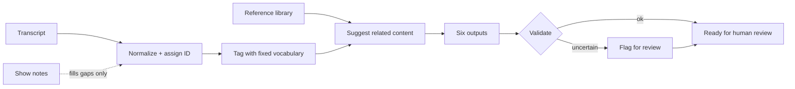

# AI Content Operations Pipeline

**One recording in, a complete publishing package out, with rules that keep AI from making things up.**

`Status: modeled on the content system I use for my own podcast and workshops · synthetic data · Python · 18 tests`

---

## The problem

I co-host a podcast and teach workshops. Every episode should become several things: a short companion piece for listeners, a deeper guided resource, copy-ready publishing material, and data that a future searchable library can use.

Doing that by hand every week was the bottleneck. Asking an AI to "write five things about this episode" created a different problem: it confidently adds exercises that were never in the episode, invents links, and mixes up what was *said* with what it *thinks*.

So I wrote an operating procedure for the AI to follow, and this repository turns that procedure into code with checks.

## What comes out

From one fictional episode transcript and some show notes, the pipeline produces six files ([see them all](generated_example/)):

| Output | Who it's for | Sample |
|---|---|---|
| Public companion | Listeners: a small practice, not a summary | [public_companion.md](generated_example/public_companion.md) |
| Deep guide | Listeners who want to go further | [deep_guide.md](generated_example/deep_guide.md) |
| Publishing sheet | Me, on publish day: title, SEO, slug, copy blocks | [publishing_sheet.md](generated_example/publishing_sheet.md) |
| Future library note | A future search/recommendation system | [future_optimization.md](generated_example/future_optimization.md) |
| `metadata.json` | Software: stable ID, controlled tags, relationships | [metadata.json](generated_example/metadata.json) |
| Validation report | Me: did everything check out? | [validation_report.txt](generated_example/validation_report.txt) |

```text
Content ID: podcast_s01e001_learning_to_rest
Recommendations: guide_noticing_pressure, blog_small_transitions, podcast_making_room
Needs review: True
Validation: PASS
Generated 6 outputs in generated_example
```

## The rules that make it trustworthy

**1. The recording outranks everything else.** Sources have a strict priority: transcript, then show notes, then templates, then everything else. Show notes can fill gaps, but they can't overrule what was actually said.

> In the demo, the show notes suggest a body-scan exercise, **but the transcript never describes one.** The pipeline doesn't adopt it. It flags the question for me instead: *"whether a somatic modality is central is unclear."* That's the exact mistake AI drafting makes, caught by a rule.

**2. Missing stays missing.** The Spotify and YouTube links don't exist yet, so they're left blank and marked "add after confirming." The pipeline never fills them with a plausible-looking URL.

**3. Every piece of content gets one permanent ID.** Titles change and URLs change, but `podcast_s01e001_learning_to_rest` doesn't. Every output and every cross-link uses the ID, so nothing breaks when I rename an episode.

**4. Two kinds of tags.** A small fixed vocabulary (pathway, depth, practice type) lets software filter reliably. Free-form "listener language" tags ("peace feels unfamiliar") keep how people actually describe their problem.

**5. "Valid" doesn't mean "done."** The metadata passes its structural checks *and* stays flagged for human review. Well-formed and correct are different questions.



## Where AI fits

In my real workflow, an AI assistant does the drafting by following these rules as written instructions. This public version replaces that drafting step with fixed templates, so every output can be reproduced and tested offline. The rules, IDs, tags, and validation are the part worth showing, and they're what keep AI-written drafts honest no matter which model writes them.

## Run it

Python 3.11+, no dependencies.

```bash
python -m pip install -e .
content-ops-demo                         # writes to generated_example/
content-ops-demo --output-dir ./out
python -m unittest discover -s tests -v
```

Design notes: [architecture](docs/architecture.md) · [metadata design](docs/metadata-design.md) · [uncertainty and review](docs/uncertainty-and-review.md) · [how this relates to the real system](docs/source-review.md)

## Limits

Everything here is fictional. It doesn't publish anything, check live URLs, or replace editorial judgment, and the guided resources are educational, not clinical.

---

Built by [Michael Perry](https://perry.is). I designed the content system and its rules, then directed AI coding agents to implement this version and reviewed the result. [More of my work →](https://github.com/perry-is)
